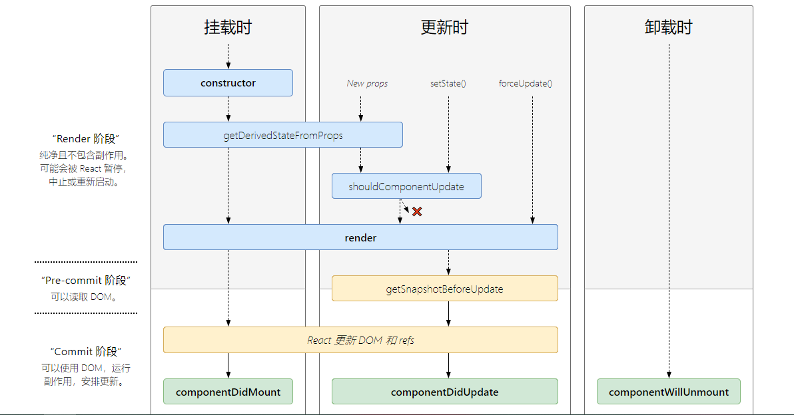
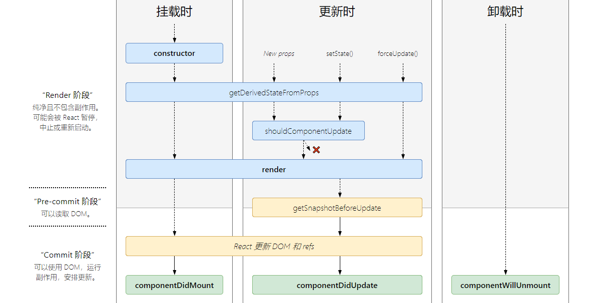

<h2 align="center">React16之后的生命周期</h2>

### 主要阶段、作用以及使用场景

 1. `constructor`
 2. `static getDerivedStateFromProps()`
 3. `render`
 4. `componentDidMount`
 5. `shouldComponentUpdate`
 6. `getSnapshotBeforeUpdate`
 7. `componentDidUpdate`
 8. `componentWillUnmount`
 9. `static getDerivedStateFromError()`
 10. `componentDidCatch()`


### 生命周期过程


#### 16.3之前的生命周期

  


#### 16.4以及之后的生命周期

  


### 其他


getSnapshotBeforeUpdate

根据 getSnapshotBeforeUpdate(prevProps, prevState) 的函数签名可知，其在组件更新之前获取一个 snapshot —— 可以将计算得的值或从 DOM 得到的信息传递到 componentDidUpdate(prevProps, prevState, snapshot) 周期函数的第三个参数，常常用于 scroll 位置的定位

```javascript


class ScrollingList extends React.Component {
  constructor(props) {
    super(props)
    // 取得dom 节点
    this.listRef = React.createRef()
  }

  getSnapshotBeforeUpdate(prevProps, prevState) {
    // 根据新添加的元素来计算得到所需要滚动的位置
    if (prevProps.list.length < this.props.list.length) {
      const list = this.listRef.current
      return list.scrollHeight - list.scrollTop
    }
    return null
  }

  componentDidUpdate(prevProps, prevState, snapshot) {
    // 根据 snapshot 计算得到偏移量，得到最终滚动位置
    if (snapshot !== null) {
      const list = this.listRef.current
      list.scrollTop = list.scrollHeight - snapshot
    }
  }

  render() {
    return <div ref={this.listRef}>{/* ...contents... */}</div>
  }
}

```