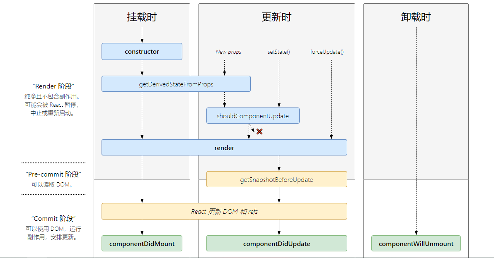
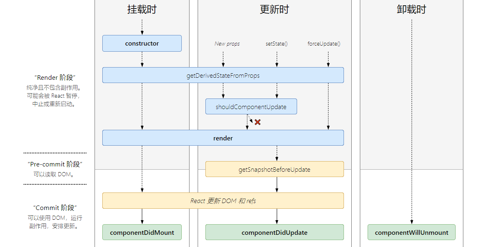

<h2 align="center">React16之后的生命周期</h2>

### 主要阶段、作用以及使用场景

 1. `constructor`
 2. `static getDerivedStateFromProps()`
 3. `render`
 4. `componentDidMount`
 5. `shouldComponentUpdate`
 6. `getSnapshotBeforeUpdate`
 7. `componentDidUpdate`
 8. `componentWillUnmount`
 9. `static getDerivedStateFromError()`
 10. `componentDidCatch()`


### 生命周期过程


#### 16.3之前的生命周期

  


#### 16.4以及之后的生命周期

  


#### 生命周期详细

- `shouldComponentUpdate(nextprops,nextstate)`

  **作用**：决定`Virtual DOM`是否需要重绘

  **其他**：

  1. 在`PureComponent`中实现了shouldComponentUpdate的功能

      使用PureComponent时，内部实现了`shouldComponentUpdate`，会进行`nextprops`与`this.props`比较，`nextstate`与`this.state`比较;有差异的话，返回`true`,重绘`virtual DOM`;而且，此外进行的是`浅比较`，如果props、或者state是对象的话，需要注意如果对象的指针没有改变的话，pureComponent不会给更新；

      PureComponent的优点：A有两个子组件B（props有个值为bValue）、C(props有个值为cValue);
      当在A中改变bvalue时：
      如果`不使用pure`,C组件的virtual dom会重新渲染；
      如果使用了`pure`,C组件的virtual dom不会重新渲染；

    
  2. 返回 false 并不会阻止子组件在 state 更改时重新渲染;
  3. this.state与this.props可以访问到旧的state


- `static getDerivedStateFromProps(props, state)`
      
  **作用**
  
  返回对象来更新`state`；一般使用props更新state,但是不会影响props的使用
  
  **注意事项**
      
  1. 不能通过`this`访问实例，通过this访问的是window

  2. `return null`不会影响state的正常更新；只有返回{}，才会更新state

  3. 不能通过this.stat与this.props访问到旧的props与state

      用法：

  ```javascript

    // props、state都是更新后的
    static getDerivedStateFromProps(props, state){
      console.log(this)  // this访问的是window
    }
  
  ```

  **使用场景**：
  
  props更新时，重置某些state;比如表单控件获取默认值（todo: 添加相应的demo）


